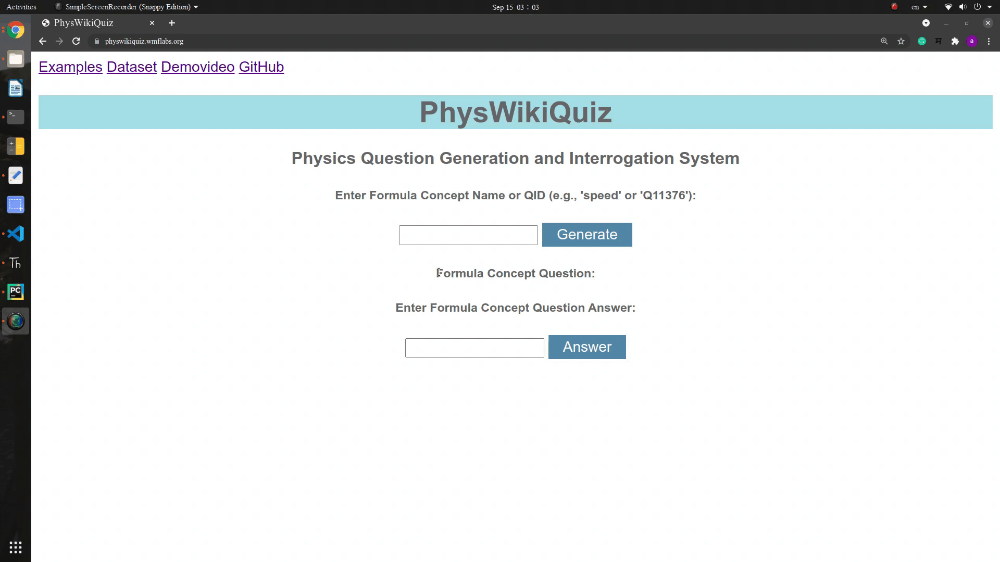
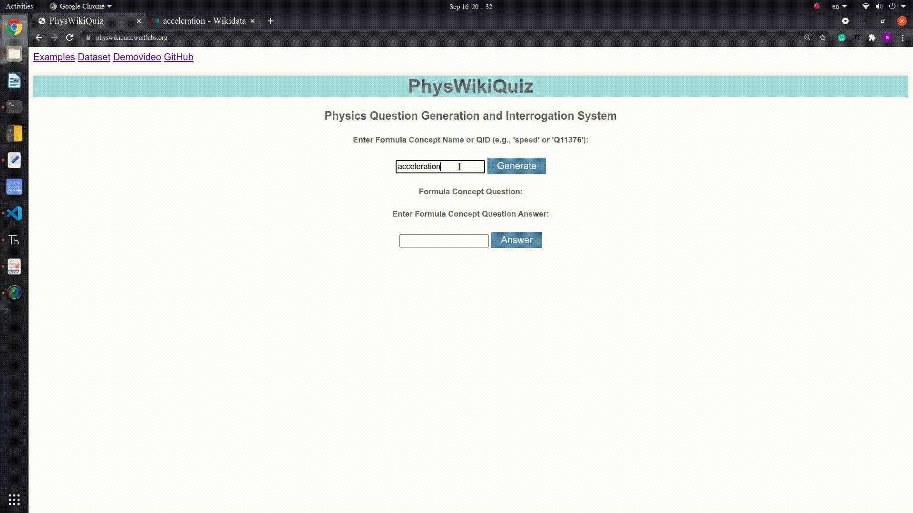
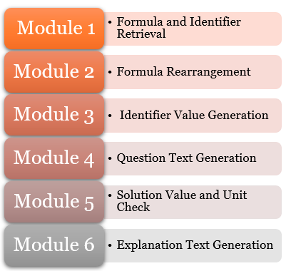
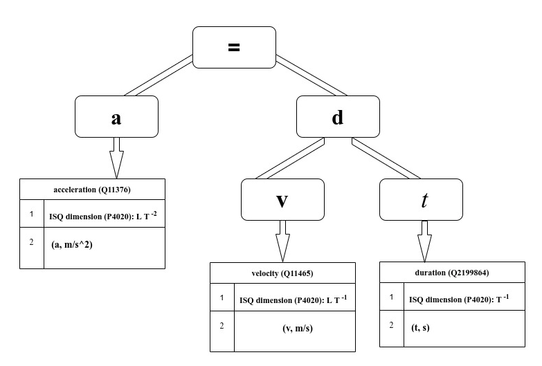
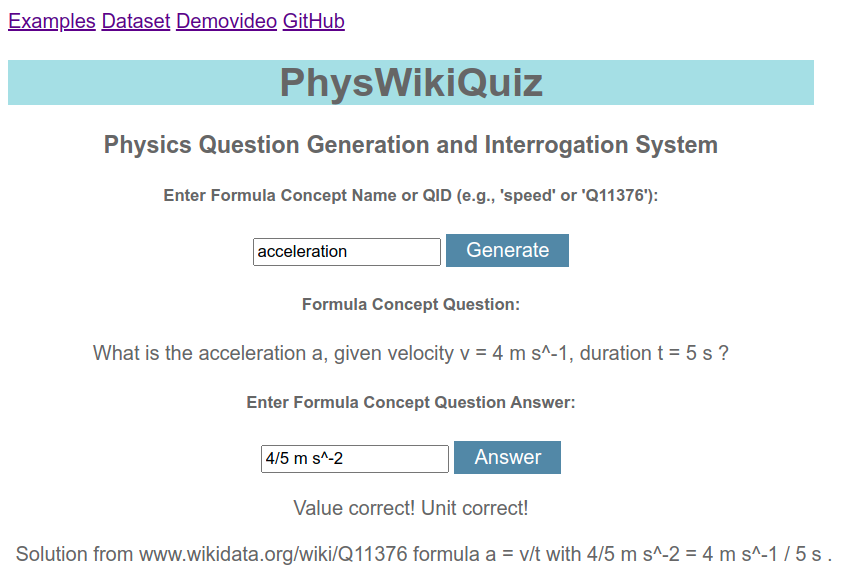

## PhysWikiQuiz 

We present **PhysWikiQuiz**, a Physics Questions Generation and Interrogation System. The system can generate physics questions from [Wikidata](https://wikidata.org) items, given a Formula Concept Name or QID (e.g., 'speed' or 'Q11376') user input. Each question contains comprehensive details of the involved physical quantities, and randomly generated numerical values. In a consecutive step, a student can input an possible answer. The system then checks the correctness of the user input in terms of value and unit respectively. In the last stage, the system finally generates an correct explanation of the solution, including its calculation path.

**PhysWikiQuiz** is a web-based system, implemented with Flask, a micro web-framework written in Python. The required metadata for formulae is retrieved from [Wikidata](https://wikidata.org) by means of [SPARQL](https://www.w3.org/TR/rdf-sparql-query/) queries or [Pywikibot](https://www.mediawiki.org/wiki/Manual:Pywikibot).

## Motivation

Examination is the essential part for every student’s academic life. A large portion of any Physics examination is based upon formula based numerical examples. This system accelerates the process of examination preparation by generating large numbers of novel questions from the open and continuously evolving source database [Wikidata](https://wikidata.org). The question generation helps students to have study material to train for exams and professors or tutors to automatically prepare exam sheets, which significantly reduces their time efforts. Moreover, generating different questions and values for each student separately makes student cheating more difficult.

## Demo Examples

Demo of example formula concept **"speed"**:



Demo of example formula concept **"acceleration"**:



You can quickly check the system hosted at https://physwikiquiz.wmflabs.org.

You also find a video demonstration of the PhysWikiQuiz system and its evaluation [here](?) (you will be redirected to YouTube).

## System Workflow

PhysWikiQuiz employs the open access semantic knowledge-base [Wikidata](https://wikidata.org) to retrieve Wikimedia community-curated physics formulae with identifier properties and units using their concept name as input. A given formula is then rearranged, i.e., solved for each occurring identifier by a Computer Algebra System (CAS) to create more question families. For each rearrangement family, random identifier values are generated (in a specified range). Finally, the system compares the student's answer input to a CAS computed solution for both value and unit separately and generates an explanation text.

**The following diagram illustrates the fundamental workflow of the system.**



In module 1, formula and identifier data is retrieved from [Wikidata](https://wikidata.org). In module 2, the formula is rearranged using the python CAS [Sympy](https://www.sympy.org). In module 3, random values are generated for the formula identifiers. In module 4, the question text is generated from the available information. In module 5, the student's answer is compared to the system's solution. Finally, module 6 generates an explanation text for the student. In case some step or module can not be successfully executed, the user is notified, e.g., 'No Wikidata item with formula found'.

**Let us learn the workflow of the system with the example formula concept "acceleration"**.

The following figure shows an example expression tree for "acceleration". Below each of the identifier symbols a, v, and t, information about its properties (Wikidata item name and QID, unit dimension) is displayed.



We now describe the module tasks using the example.

**Module 1** retrieves **formula and identifier information** from Wikidata properties:

 * 'defining formula' (P2534): 'a=\frac{dv}{dt}'
 * 'in defining formula' (P7235): 'a'
 * 'has part' (P527) or 'calculated from' (P4934):
    * 'velocity' (Q11465)
    * 'duration' (Q2199864)

**Module 2** generates **various possible rearrangements** of the retrieved formula:

 * 
 * 
 * 

**Module 3** generates **random numerical values** for the unknown identifier variables and performs the required mathematical operations in order to calculate the **numerical value of the desired identifier**:

 * For the two available formula rearrangements , , and , the system calculates the respective right-hand side identifier values by performing the required multiplication or division operation. The result is later compared to the user input to check its correctness.​

**Module 4** generates a **well-structured question in natural language** by using the available names, symbols, and values for the occurring formula identifiers.

 * **In our example case**:
   "What is the acceleration a, given velocity v = 4 m s^-1, duration t = 5 s?"

**Module 5 checks the solution value and unit** entered by the user and displays a correctness assessment.

**Module 6 generates an explanation text** with the formula (including source) and a calculation path for the student's understanding.

 * **In our example case**:
   "Solution from www.wikidata.org/wiki/Q11376 formula a = v/t with 4/5 m s^-2 = 4 m s^-1 / 5 s ."

In the following, you can see the final stage of the system, after finishing all tasks:
   

## Number of Questions

In principle, PhysWikiQuiz does not depend on formula rearrangements and the workflow would be complete without them. However, they enhance the availability of additional question variations. In the case of our example "speed", using Sympy rearrangements also the other variables "distance" and "durations" can be queried, providing additional concept questions.

The number of questions generated by >>PhysWikiQuiz<< can be calculated as N_generated =  R_values * (N_identifiers - 1)
with
N_identifiers: Number of identifiers in Formula Concept,
R_values = 10: Range for random identifier value generation (here from 1-10).

This leads to the following table:

| N_identifiers | N_generated   |
| ------------- |---------------|
| 1             | 1             |
| 2             | 20            |
| 3             | 300           |
| 4             | 4000          |
| 5             | 50000         |
| 6             | 600000        |
| 7             | 7000000       |
| 8             | 80000000      |
| 9             | 900000000     |
| 10            | 10000000000   |

It is evident that for large formulae, PhysWikiQuiz can generate a tremendous amount of question variations. But even for a small formula with 2 identifiers there are already 20 possibilities. On average, the formulae in the testset contain 3 identifiers, which leads to 300 potential questions per Formula Concept. Without rearrangements the possibilities need to be divided by the number of formula identifiers.

## Evaluation on Benchmark

unit_test_module_workflow_latex2sympy_evaluated(short).png

## Installation Dependencies

A deployed version of the system is available online, hosted by Wikimedia at https://physwikiquiz.wmflabs.org. Installing locally on your machine, the system mainly depends on the following python packages (for a full list see `requirements.txt`).

### Flask
The web framework Flask `version 0.12.2` is used as web framework middleware used as an interface between the frontend and the backend.
```
pip3 install Flask
```
### Requests
Requests `version 2.26.0` is an HTTP library designed to make HTTP requests simpler and more human-friendly.
```
pip3 install requests
```
### Pywikibot
Pywikibot `version 5.6.0`is used to extract the formula concept data from Wikidata: [https://tools.wmflabs.org/pywikibot](https://tools.wmflabs.org/pywikibot)
```
pip3 install pywikibot
```
### SPARQLWrapper
SPARQLWrapper `version 1.8.2` is a simple Python wrapper around a [SPARQL](https://www.w3.org/TR/sparql11-overview) service to remotely execute queries. It helps to create the query invokation and convert the result into a more manageable format.
```
pip3 install sparqlwrapper
```
### Sympy
The Computer Algebra System (CAS) Sympy `version 1.7.1` is used for the calculation module to get result values given a retrieved formula and inputs for the variables. 
```
apt-get install python3-sympy
```

### Latex2Sympy 
LaTeX2Sympy `version 1.6.2` is used to convert variants of LaTeX formula strings to a Sympy equivalent form.

1) ANTLR is used to generate the parser:
```
sudo apt-get install antlr4
```
2) Download latex2sympy from [https://github.com/augustt198/latex2sympy](https://github.com/augustt198/latex2sympy)

### **To clone or download the repository**
```
git clone https://github.com/ag-gipp/PhysWikiQuiz.git
```

## API references

 * [Wikidata](https://wikidata.org): A SPARQL query to the [Wikidata Query Services API](https://query.wikidata.org) retrieves lists or properties of [Wikidata items](https://en.wikipedia.org/wiki/Wikidata#Items)
 * [VMEXT](https://vmext-demo.formulasearchengine.com/swagger-ui.html): LaTeX to SymPy formula conversion is done via the 'LaCASt' translator

## Authors

* Philipp Scharpf
* Moritz Schubotz

## License

This project is licensed under the Apache License 2.0.

## Acknowledgments

We thank the Wikimedia foundation for [hosting](https://physwikiquiz.wmflabs.org) our web-based system.